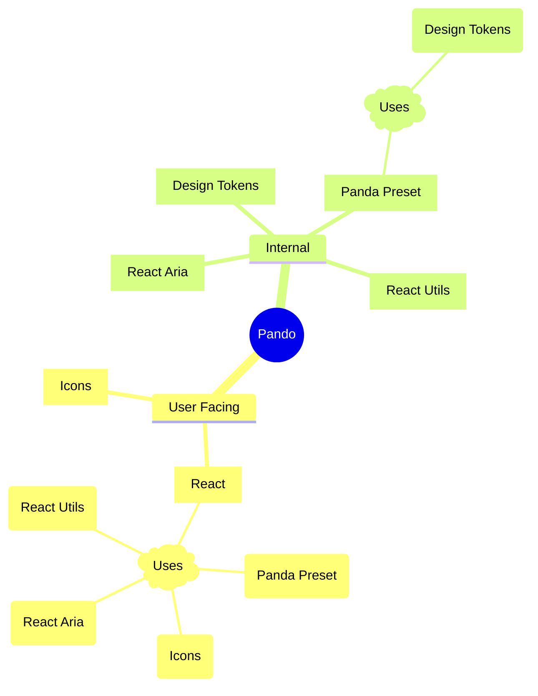

# Panda Preset

A preset and config for Pando projects that use Panda CSS :panda:.

## What role does this package play in Pando?



This package allows Pando to have a single source of truth for all things CSS. It contains the following:

- Design Tokens
- CSS Reset
- Themes
- Panda General Config
- CSS-in-JS API's

### Panda Preset General Function

The Panda Preset will be used in all Pando projects and thus internally used in the React package. It will be used to generate the CSS-in-JS/JSX API's and will be used to generate the Atomic CSS for the React package and build time within each local project.

## Install

This project uses bun so there are no setup commands needed. If you get any errors, you may need to run an initial `bun install` or ensure you are using Node >= 18.

## Development

From the **root directory of the project**, run:

```bash
bun run start:sandbox
```

## Testing

From the **root directory of the project**, run:

```bash
bun test tests/panda-preset
```

## Contribution

If you plan on contributing to this project, please take time to read our [CONTRIBUTING.md](https://github.com/pluralsight/pando/blob/main/CONTRIBUTING.md). Pull requests that do not adhere to the requirements in this doc will automatically be flagged and closed.
